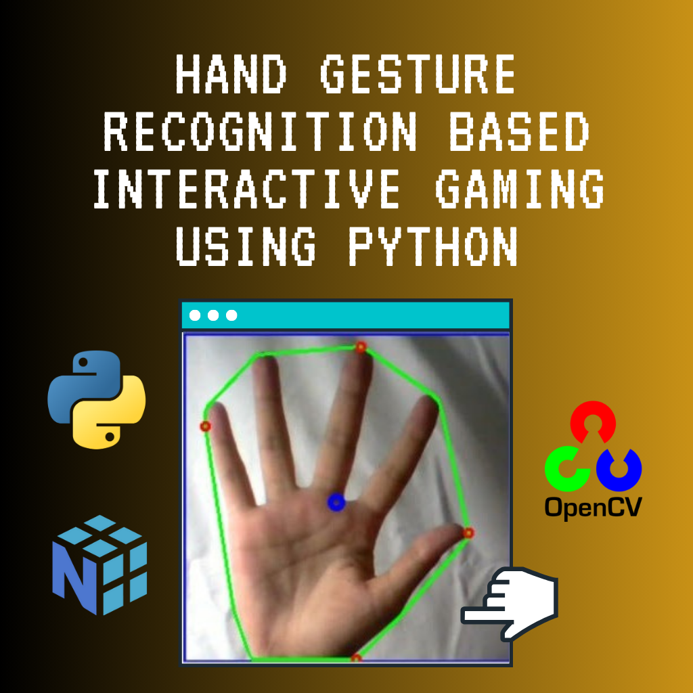

# [Hand Gesture Recognition Based Interactive Gaming using Python](https://karantrehan3.github.io/Hand-Gesture-Recognition-Based-Interactive-Gaming/)





Wouldn’t it be fun, if you could use your hand to control the car in a game? So, here we have proposed a computer vision concept to control the game with hand gestures by mapping gestures to the W, A, S, D keyboard keys.

Tested on games like: Need for Speed, GTA 5, Blur, Spiderman.

## Video Tutorial



The code is well documented at each step and is easy to understand and implement.

## Libraries Used

- imutils
- numpy
- opencv2
- time
- sklearn
- pyautogui
- ctypes

## Installation

To install the required libraries, you can use the `requirements.txt` file provided in the `src` directory. Run the following command in your terminal:

```sh
cd src
pip install -r requirements.txt
```

## Scripts

**The repository includes several main python(.py) files particularly:**

1. `control.py` (Code to map gesture- slope and distance with the keys)
2. `directkeys.py` (Code to interact with the keyboard keys. Reference: [Simulate Python keypresses for controlling a game](https://stackoverflow.com/questions/14489013/simulate-python-keypresses-for-controlling-a-game%20#%20))
3. `camera.py` (Code to handle camera initialization and release)
4. `trackbars.py` (Code to create and manage trackbars for HSV values)
5. `processing.py` (Code to process frames and contours)
6. `main.py` (Main code to run the application)

## How to run the code? (An In-Depth Explanation)

### Steps to Run the Code:

1. **Download and Unzip Scripts**:

   - Download the `src/scripts` directory and unzip all `.py` scripts in the same folder. This ensures that all necessary scripts are available in one place for the application to run smoothly.

2. **Set Up the Development Environment**:

   - We have used PyCharm Community Edition to run the codes. However, you may use other Python editors that support the required libraries. Ensure that your development environment is properly configured to run Python scripts.

3. **Run the Main Application**:

   - Execute the `main.py` file. This is the entry point of the application and integrates all the functionalities provided by the other scripts.

4. **Adjust HSV Values**:

   - Use the trackbars to adjust the HSV (Hue, Saturation, Value) values so that only your hand is visible in the camera feed. This step is crucial for accurate gesture detection.

5. **Start Gesture Recognition**:
   - Set the Start trackbar to 1. This activates the gesture recognition functionality, allowing you to use your hand to control the game.

### Notes:

1. **Background and Lighting**:

   - For better accuracy, use a plain white or black background. Ensure that the room is well-lit to improve the visibility of your hand in the camera feed.

2. **Customizing Gesture Mapping**:

   - You are free to modify the slope and distance values in `control.py` depending on the gestures you make. This allows you to customize the gesture recognition to suit your preferences.

3. **Mapping More Gestures**:
   - You can map additional gestures to keys. Refer to the [link](https://gist.github.com/dretax/fe37b8baf55bc30e9d63) for more information on how to simulate keypresses in Python.

### Flow of the Application:

1. **Camera Initialization**:

   - The application starts by initializing the camera using `camera.py`. This script handles the setup and release of the camera.

2. **Trackbars Setup**:

   - Trackbars for adjusting HSV values are created and managed using `trackbars.py`. These trackbars allow you to fine-tune the color detection parameters.

3. **Frame Processing**:

   - Each frame captured by the camera is processed to detect contours using `processing.py`. This script applies various image processing techniques to identify the hand in the frame.

4. **Gesture Mapping**:

   - The detected gestures are mapped to keyboard keys (W, A, S, D) based on slope and distance calculations in `control.py`. This script translates the hand movements into corresponding keypresses.

5. **Keyboard Interaction**:

   - The mapped gestures are used to simulate keypresses to control the game using `directkeys.py`. This script interacts with the operating system to send keyboard inputs.

6. **Main Application**:
   - The main application logic is handled in `main.py`, which integrates all the above steps. This script coordinates the overall flow of the application, ensuring that each component works together seamlessly.

By following these steps and understanding the flow of the application, you can effectively use hand gestures to control games and customize the gesture recognition to suit your needs.

Hope you Like it! Thanks.
